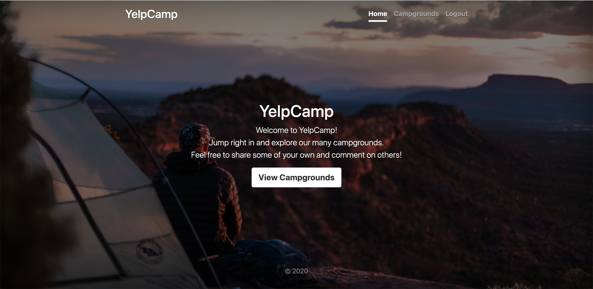
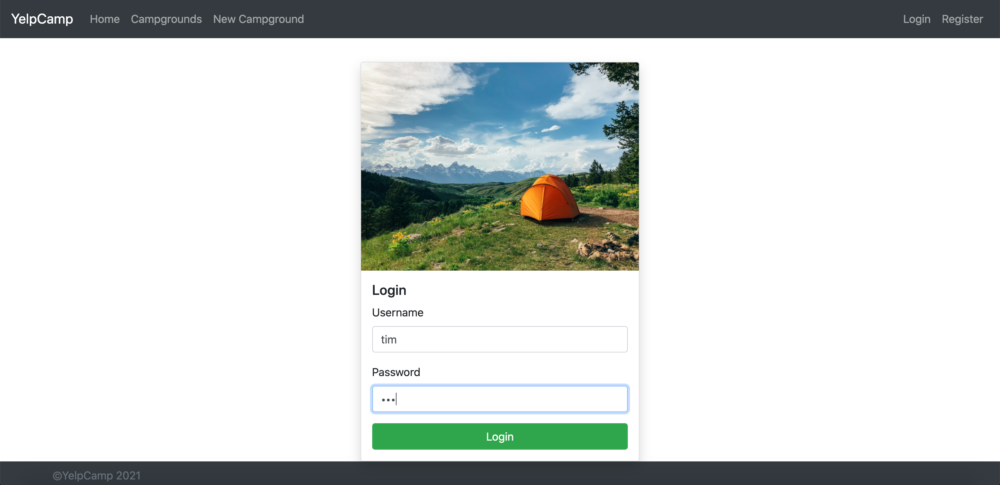
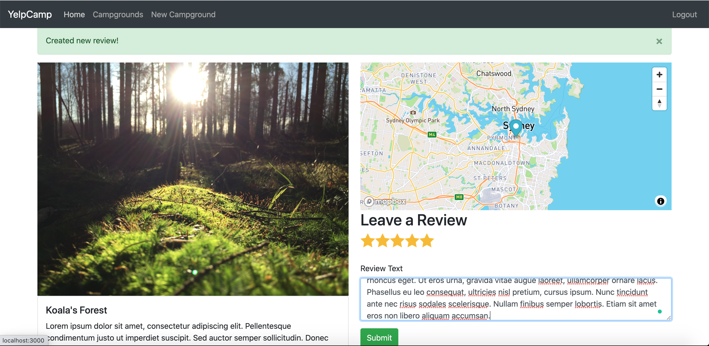
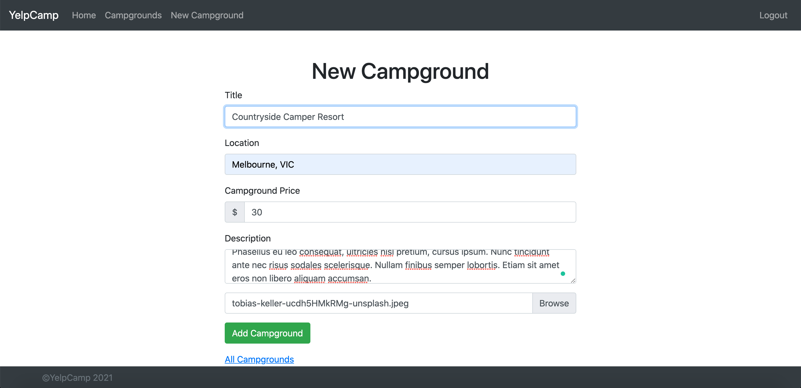
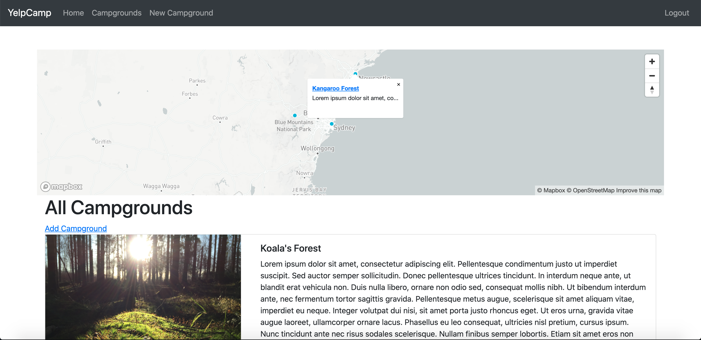
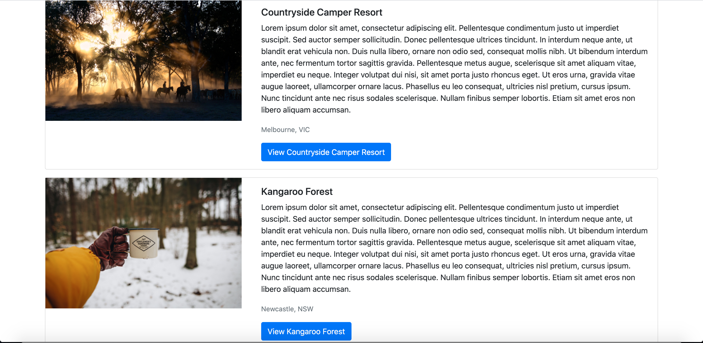

Hello there!
This is my first project after I finish my Web Developer Bootcamp called YelpCamp.
YelpCamp is a marketplace of campgrounds, including photos, descriptions, prices and, the option to leave reviews and ratings for each campground. 
There is also a map showing the location of each campground and a general map with clusters showing areas with more options of campgrounds. The intention was to simulate Airbnb but with campgrounds. 
Feel free to send pull requests with any suggestions on how I could improve the code. 
For this project, I used (technologies list).
I have been using **JavaScript,** **HTML,** **CSS,** **Bootstrap,** Express,** **DOM,** **EJS,** **Middleware,** **Cookies,** **Session,** **Flash,** **Passport,** **Bcrypt,** **Joi,** **Cloudinary,** **MapBox,** **GeoJson,** **MongoDB,** **Helmet,** **Cross-Site Script,** **Scratch** ...
Cheers,
*Lucas Borba*
*lborba194@gmail.com*

## Images:

